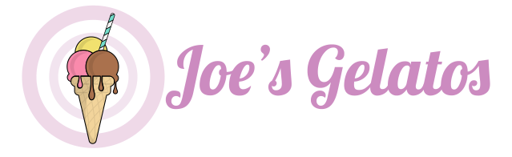
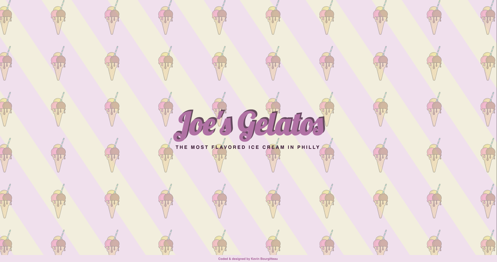

# Joe's Gelatos - 

A simple header to practice the mouse move.

---

## 🛠 Tech Stack

**Client:**

**Server:**

---

## 💡 Features

---

## 💻 Softwares used

 - Development  
 - Logo design  
 - Notes & organization  

---

## 📲 Deployment

---

## 🎨 Color Reference

| Color      | Hex                                                                |
| ---------- | ------------------------------------------------------------------ |
| Cream  |  `#F4F0E1` |
| Strawberry  |  `#B97CAE` |
| Light strawberry |  `#F2E4EF` |
| Berry     |  `#492543` |
| Mint     |  `#72DCCA` |

---

## 📸 Screenshots

---

## 🔗 Links

